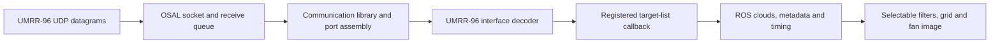

# UMRR-96 Smart Access SDK audit

Investigated on 2026-09-24 with Smart Access Automotive **3.13.0**, UMRR-96
Type 153 firmware **5.2.2**, and interface **1.2.2**. The live driver, control
node, views and RViz stayed running throughout the initial investigation. That
investigation changed no installed SDK files, running executables, sensor
settings or network configuration. The subsequent implementation below was
built and tested after stopping the live launch at the user's request.

## Findings at audit time

| Finding | Evidence | Driver consequence |
| --- | --- | --- |
| Four variance fields are available in actual radar packets | 30 captured frames, 953 detections, all finite and nonzero | Stop replacing these reported measurements with NaNs in a future driver update |
| Peak indices and acquisition setup are available | Peak indices 0–43; setup 49 (`0x31`) in this sample | Preserve them as raw metadata; verify setup bit meanings before decoding |
| F32 instruction conversion has undefined behavior | ASan/UBSan reproducer detects an 8-byte read from a 4-byte float | Fix the conversion before extending float parameter controls |
| Device monitor does not establish liveness for static routes | `IsClientConnected()` returned true before any replay traffic arrived | Keep diagnostics based on actual target arrival and control responses |
| Time synchronization exists but is off | Vendor master/slave APIs plus successful live readback | Investigate a separate synchronization mode; retain ROS receive-time stamps meanwhile |
| Public high-level receive API lacks explicit unregister/stop | Communication and UMRR-96 stream interfaces expose Init/Get/Register only | Keep process isolation; component unloading needs callback ownership/draining work |

The tools and machine-readable measurements are in
[`tools/sdk_audit`](../tools/sdk_audit). Full packet captures and decoded scene
data stay outside Git; the results record the source capture's SHA-256.

## What is actually installed

The bundle lockfile distinguishes several version numbers:

| Component | Lockfile version |
| --- | --- |
| Automotive bundle | 3.13.0 |
| Baseline meta package / bundled changelog | 5.6.0 |
| Smart Access API | 2.9.1, also returned by the isolated runtime probe |
| ComLib | 6.11.0 |
| OSAL Linux implementation | 1.7.0 |
| UMRR-96 interface implementation package | 4.9.0; interface contract 1.2.2 |

At audit time, the installed API headers matched the downloaded reference copies
byte for byte. The subsequent F32 repair changes `Instruction.h` only. This bundle
supplies binary core libraries, public/generated headers,
interface definitions and OSAL example source; it does not supply the core
communication/target-decoder implementation source.

The [upstream driver's compatibility table](https://github.com/smartmicro/smartmicro_ros2_radars#umrr-radars-and-smart-access-api-version)
pairs UMRR-96 interface 1.2.2 with firmware 5.2.4. Our hardware reports 5.2.2.
Successful target decoding and the exercised settings reads establish those
paths on this hardware, not compatibility of every optional command. Review
firmware release notes/vendor compatibility before relying on additional modes;
this audit did not update firmware.

## Receive path and available information



The UMRR-96 stream interface provides two decoded callbacks: `ComTargetList`
and `ComTargetBaseList`. The latter also has a CAN serialization definition.
The common low-level data service can observe generic ports, but the examined
UMRR-96 interface exposes no ADC, range-Doppler cube or raster intensity stream.
A target's peak index does not by itself expose a peak list or raw spectrum.

We replayed earlier Ethernet packets from this sensor into a separate observer
on `127.0.0.1`, using ephemeral ports and private SDK configuration. All 30
decoded frames were port version **2.1**. Header counts matched the complete
decoded target lists (953 detections total), and no inspected getter threw or
returned a nonfinite value. Cycle times were approximately 0.11997–0.11999 s.

| SDK field | Observed minimum | Observed maximum | Interpretation |
| --- | ---: | ---: | --- |
| Range variance | 0.000379506 | 0.000506981 | Reported values vary; discarded by the callback at audit time |
| Radial speed variance | 0.000445115 | 0.000668419 | Same |
| Azimuth variance | 0.0000694993 | 0.00132084 | Same |
| Elevation variance | 0.0000568762 | 0.0000592398 | Same |
| False-alarm probability | 0 | 0 | Zero throughout is not evidence of perfect confidence |
| Flags | 0 | 0 | Bit definitions/validity still need confirmation |
| Peak index | 0 | 43 | An index, not a tracked-object ID |
| Acquisition setup | 49 | 49 | Preserve as an opaque 16-bit value until its layout is established |

The variance getters are named/documented as variances, but the inspected API
reference does not fully specify calibration or squared units. Publishing their
raw reported values with provenance is justified; immediately treating them as
calibrated covariance weights is not. Check version validity and units before
using them for probabilistic mapping or fusion.

The audited callback in `smartmicro_radar_node.cpp` already emitted the corresponding
point fields but filled all four variances, false-alarm probability, flags and peak
index with sentinels. It also omitted `GetAcquisitionSetup()`. The implementation
below exposes supported fields without changing the sensor or creating additional
detections. The replay showed no mismatch between SDK target
counts and the lists handed to the application.

The parameter definition contains 29 controls, including sweep selection,
antenna, PRF selection, per-sweep speed validation, output enables, networking
and synchronization. No general CFAR/SNR threshold or "density" control was
found in that definition. Object-output enable names alone do not establish an
available decoded object stream for this model/firmware.

## Confirmed float serialization defect

`InstructionBase<float>::GetConvertValue()` in the vendor `Instruction.h`, lines
172–181, reinterprets a local four-byte float as `uint64_t*`, reads eight bytes,
then masks to 32 bits. Masking after the load does not make the load valid.

The standalone probe does not initialize the SDK or send packets. ASan reports
`stack-buffer-overflow`, with an eight-byte read at line 178. UBSan independently
reports insufficient storage. The original header SHA-256 is
`1bfb51bfa7b2fe53c55f97a5cfe4db11424ab561e4c153253d77289aa4b1c9e2`.

In an isolated header copy, replacing the punning load with a four-byte copy
removed the sanitizer error and returned `0x3fc00000` for 1.5f:

```cpp
uint32_t bits{};
std::memcpy(&bits, &tmp, sizeof(bits));
result = bits;
```

The extraction repair now applies this four-byte copy reproducibly. The
ASan/UBSan regression covers negative values, signed zero, subnormals, nonfinite
bit patterns, float read requests and existing integer conversions. The code is
shared by float instruction specializations. The panel's four tuning operations
continue using `uint8_t`.

## Synchronization: supported API, unverified timing contract

The vendor manual describes a time-sync master that registers a reference-clock
callback, adds slave IDs, and starts/stops synchronization. It specifies the
reference callback in **milliseconds**, while the target-port timestamp is being
handled as **microseconds**. A sync slave ID is separate from the sensor client ID.
Do not assume the two time units or identifiers are interchangeable.

Live read-only results:

| Parameter | Value |
| --- | ---: |
| `sync_mode` | 0 (off) |
| `sync_slave_identifier` | 0 |
| `sync_group_identifier` | 0 |
| `sync_interface` | 2 (Ethernet) |
| `time_sync_mode` | 0 (off) |
| `time_sync_nof_devices` | 1 |

The interface distinguishes acquisition synchronization controls from time-sync
controls. Before enabling either, establish the exact firmware protocol, clock
units/epoch, accuracy, reboot behavior and loss-of-sync indication. A future
clock mode must not claim synchronized acquisition time merely because SDK
initialization succeeds. The driver continues using ROS receive time.

## Threading, lifetime and performance implications

The bundled OSAL implementation has a UDP receive thread and a callback thread.
It copies incoming datagrams into allocated buffers and pushes them into a
`std::queue`; no queue bound is visible in that implementation. The callback
thread invokes its selected callback synchronously, then deletes the input
buffer. Matching implementation symbols are exported by the bundled `libosal`.

Consequences identified during the audit:

- Keep receive callbacks short. Per-frame `std::cout << ... << std::endl` logging,
  point-cloud allocation and ROS publication all occurred there. A slow
  callback can cause backlog rather than merely lowering output frequency.
- Preallocate point storage and remove routine flushed console logging before
  adding a new worker queue. If work is offloaded, define bounded capacity and
  an explicit drop policy, and establish ownership of decoded objects/buffers.
- OSAL unregister removes a callback from a map, but the callback thread can
  already hold a copy outside the map lock. That is not proof that unregister
  waits for in-flight work. The high-level UMRR-96 API has no public unregister
  method at all.
- Resetting one communication-service shared pointer does not establish that all
  singleton objects, threads and callbacks have stopped. The driver also retains
  global stream-service pointers and callbacks capturing `this`.
- The OSAL example holds one unicast UDP interface and keys receive callbacks by
  source IP. A second callback registration for that IP is rejected. This is
  another reason to validate multiple-socket/mixed-serialization behavior before
  merging the current data and control processes. It does not prove that mixed
  instruction/data serialization is impossible; the config schema supports them
  independently.

The device monitor returned connected **before replay began**, with `alive=false`
and a static route. Thus it cannot replace target age or successful control
responses as a liveness check in this deployment. The manual also requires
`alive=false` for automotive radars; enabling discovery is not the solution here.

## Implementation status after the audit

The live driver, control node, views and RViz were stopped before rebuilding and
remain stopped. Offline tests use loopback UDP and isolated ROS domains; no
sensor configuration or firmware writes were performed.

- F32 conversion now reads exactly four bytes, preserving the IEEE bit pattern
  and zero-extending into the SDK's 64-bit container. Extraction applies the
  tracked repair; CMake verifies it without mutating the SDK. The original defect
  reproducer remains available, and the production regression runs with ASan/UBSan.
- The UMRR-96 Ethernet callback publishes all four reported variances and peak
  index. `PortTargetHeader` adds an opaque 16-bit acquisition setup and validity
  flag. Other model callbacks leave that flag false. The 18-field, 72-byte point
  layout is unchanged. Consumers of the changed custom header must be rebuilt.
- That callback reserves the target count before filling the cloud and no longer
  flushes a console message every frame. No additional receive queue was added.
- Every data callback and legacy instruction-response callback registered by the
  data node passes through a shared gate. Shutdown/destruction closes the gate,
  rejects late entries and waits for active callbacks to finish. Construction
  failures also drain callbacks before destroying members. The ROS shutdown hook
  retains only gate state, avoiding a dangling node pointer. Firmware progress
  callbacks use the same guard on their owning helper.
- Removed the fixed two-second delay after successful synchronous SDK
  initialization and the 100 ms shutdown delay. SDK initialization status and
  callback draining replace those delays.

All **28 focused tests** passed: 26 driver/processing checks and two RViz checks.
The replay regression checks exact per-target quality values, acquisition setup,
configuration isolation and orderly shutdown while packets are still arriving.
Gate tests cover draining, late callbacks after owner destruction, retained
shutdown hooks, repeated closure and exceptions. No firmware update was attempted.

An additional ROS replay of the earlier physical-sensor capture matched all 30
reference frames and 953 detections from the standalone SDK decoder. Every
published variance and peak index matched exactly; acquisition setup was 49 on
all frames. The 18-field, 72-byte layout and normal shutdown/configuration cleanup
also passed. This uses recorded packets, not a new live sensor test.

This protects node-owned state while callback code remains loaded. The vendor
still exposes no high-level unregister/stop; singleton state, retained callbacks
and shared-library unloading remain unresolved. Keep data/control in separate
processes, and do not claim component unloading/reloading or lifecycle support.
Variance calibration, flag/probability semantics and sensor-clock synchronization
still need vendor or hardware validation.

## Original recommended implementation order

1. Fix and regression-test F32 instruction conversion without editing the running
   installation; retain the vendor defect reproducer.
2. Populate the four supported UMRR-96 variance fields and peak index, and preserve
   raw acquisition setup in typed metadata. Document unknown flag/probability
   semantics; do not convert zeros into a confidence claim.
3. Remove flushed per-frame logging, reserve cloud storage, and measure callback
   time/backlog before selecting any larger threading changes.
4. Audit callback lifetime and shutdown before component unloading/lifecycle
   support. Preserve separate SDK processes until alternatives are verified.
5. Explore optional sensor-clock synchronization as a separate hardware experiment
   with explicit quality/fallback reporting.

## Primary evidence

- [Installed bundle lockfile](../umrr_ros2_driver/smartmicro/SmartAccessAutomotivelinux.lock)
- [UMRR-96 target getters](../umrr_ros2_driver/smartmicro/include/umrr96_t153_automotive_v1_2_2/comtargetlist/Target.h)
- [UMRR-96 header getters](../umrr_ros2_driver/smartmicro/include/umrr96_t153_automotive_v1_2_2/comtargetlist/TargetListHeader.h)
- [UMRR-96 stream interface](../umrr_ros2_driver/smartmicro/include/umrr96_t153_automotive_v1_2_2/DataStreamServiceIface.h)
- [Instruction conversion](../umrr_ros2_driver/smartmicro/include/Instruction.h)
- [Time-sync master interface](../umrr_ros2_driver/smartmicro/include/TimeSyncMasterIface.h)
- [Vendor user manual, sections 5.2–5.4, 6.2, 6.4 and 7.1](../umrr_ros2_driver/smartmicro/doc/user_manual.pdf)
- [OSAL UDP implementation](../umrr_ros2_driver/smartmicro/example/OsalLinux/src/ethernet/UdpIface.cpp)
- [OSAL callback registration](../umrr_ros2_driver/smartmicro/example/OsalLinux/src/ethernet/UnicastIface.cpp)
- [Recorded measurements](../tools/sdk_audit/results-2026-09-24.json)

SDK links require the locally extracted vendor bundle; the SDK remains outside Git.
