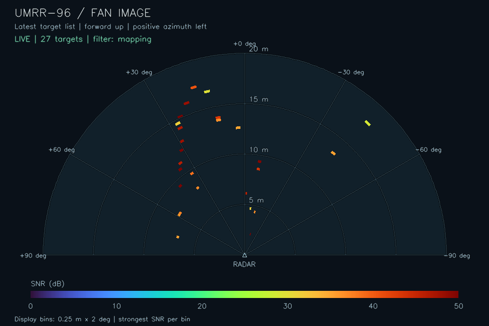

# UMRR-96 hardware bringup on cam-ripper

The radar connected on 2026-09-24 retained its factory network settings even
though it was plugged into the host's 10.2.2.x Ethernet segment. A packet capture
showed it repeatedly requesting its receiver address via ARP.

| Setting | Observed value |
| --- | --- |
| Radar IP | `192.168.11.11` |
| Radar MAC | `90:df:b7:00:88:ef` |
| Receiver IP / UDP port | `192.168.11.17:55555` |
| Host interface | `enp68s0f0` |
| Host primary IP | `10.2.2.74/24` |
| Wire client ID | `0x00038553` (`230739` decimal), matching label suffix `8553` |
| Target-list port version | `2.1` |
| Readback receiver | `192.168.11.17:55556` |
| Firmware readback | `5.2.2` |

## Start the driver

From the workspace root, after completing the [Lyrical build](lyrical.md):

```bash
# Add a secondary address to the active connection without saving the profile.
nmcli device modify enp68s0f0 +ipv4.addresses 192.168.11.17/24
ping -c 2 192.168.11.11

source /opt/ros/lyrical/setup.bash
source install/local_setup.bash
ros2 run umrr_ros2_driver smartmicro_radar_node_exe \
  --ros-args -r __node:=smart_radar \
  --params-file src/smartmicro_ros2_radars/umrr_ros2_driver/param/radar.params.umrr96_38553.yaml
```

The secondary address is temporary and may need to be reapplied after a reboot
or connection reactivation. To remove it after stopping the driver:

```bash
nmcli device modify enp68s0f0 -ipv4.addresses 192.168.11.17/24
```

The SDK normally binds to the interface's first IPv4 address. The optional
`adapters.adapter_0.hw_ip_address` parameter selects the local address explicitly;
this setup requires `192.168.11.17`. Omitting the parameter or setting it to an
empty string retains automatic interface address selection. The driver removes
any previously generated explicit address when the parameter is empty.

The target cloud is published on `/smart_radar/port_targets_0`, with frame
`umrr96`. Target metadata is on `/smart_radar/port_targetheader_0`. In another
terminal with the same ROS environment:

```bash
ros2 topic hz /smart_radar/port_targets_0
ros2 topic echo /smart_radar/port_targetheader_0 --once
```

## Live RViz view

After adding the secondary host address and sourcing the workspace as above,
start the data driver, parameter readback node, derived views, and RViz together:

```bash
ros2 launch umrr_ros2_driver umrr96_live.launch.py
```

The default is a top-down **detection-density grid**, with radar forward pointing
up and positive azimuth to the left. Select the **2D range/azimuth fan** or the
original 3D point view at startup:

```bash
ros2 launch umrr_ros2_driver umrr96_live.launch.py view:=fan
ros2 launch umrr_ros2_driver umrr96_live.launch.py view:=live
```

Run one launch at a time. Closing RViz stops all three supporting nodes. Stop any
separately running radar driver before using this launch file. The grid and fan
configurations both include **Detection density** and **Fan targets** checkboxes;
toggle these in Displays to switch or overlay the views without restarting.
Scroll over the view to zoom, and use the middle mouse button to pan.
All three configurations also open **Radar fan image**, an ordinary RViz Image
display showing the raster fan separately from the 3D scene.

The original `view:=live` configuration shows targets colored by return power,
with a dim gray `Recent targets (2 seconds)` layer for historical context.
All configurations use fixed frame `umrr96` and include the sensor control panel.

### Density grid and fan

Each detection adds one hit to its 0.25 m Cartesian XY cell. Counts decay
exponentially with a two-second time constant: a hit retains about 37% of its
weight after two seconds. Cells disappear below 0.25 weighted hits. Blue cells
have fewer recent hits; cyan and yellow indicate more, with the color scale
saturating at 20 weighted hits. These are hit counts, so increasing the sensor's
frame rate also increases the displayed density.

This is a detection-history view, not an occupancy or free-space map. Empty
cells are unknown; the view does not clear along radar rays, interpolate missing
returns, or improve the sensor's physical resolution. History is accumulated in
the sensor frame without motion compensation. Moving the radar can smear the
history; let it decay or clear it explicitly:

```bash
ros2 service call /smart_radar/reset_density std_srvs/srv/Empty '{}'
```

The fan displays only the latest scan, projected from measured slant range and
azimuth onto a flat plane. It can therefore differ from the Cartesian grid for
targets with elevation. Color represents SNR on a fixed 0–50 dB scale, and range
arcs mark 5, 10, 15, and 20 m. The fan is cleared after one second without input.
The default 20 m range and ±90° azimuth are display bounds, not a statement of
the sensor's field of view. A wider sensor sweep does not automatically enlarge
the display bounds.

### 2D raster image

`/smart_radar/fan_image` is a 960 x 640 `sensor_msgs/Image` with `rgb8` encoding.
It contains a fan-shaped range/azimuth raster, labeled range rings, azimuth
spokes, an SNR color legend, and input status. Forward is up and positive azimuth
is left. Each detected range/azimuth bin is colored by its strongest SNR, clipped
to 0–50 dB. Empty bins retain the background. The default display bins are
0.25 m by 2 degrees; these do not imply physical radar resolution.

The image renders the latest target list. It does not contain raw radar samples
or interpolate energy between detected targets. It says **WAITING FOR DATA**
before the first scan, then **NO RECENT SCAN** and clears detections after one
second without input. A valid empty scan is shown as **LIVE | 0 targets**.
Fresh images carry the source scan timestamp; waiting/stale images carry the
render time. Rasterization runs at `publish_hz` only while an image subscriber
is present, so faster scans may be skipped for display.

The **Radar fan image** dock can be resized or floated independently of the
grid. To view only the image in a separate image viewer (installed on this host):

```bash
ros2 run rqt_image_view rqt_image_view /smart_radar/fan_image
```

The data driver and `umrr96_views` must already be running, or be supplied by a
replay. The image viewer itself does not start the radar. Image rendering,
orientation, SNR selection, packed RGB output, and stale-data clearing have been
checked with synthetic input. Live checks on 2026-09-24 also received the image
at approximately 10 Hz and confirmed RViz's image subscription.

Example image from the live sensor in Stable mapping mode:



### View parameters and topics

The `/umrr96_views` section in
[`radar.params.umrr96_38553.yaml`](../umrr_ros2_driver/param/radar.params.umrr96_38553.yaml)
sets `cell_size`, `decay_seconds`, `density_full_scale`, `max_range`,
`half_angle_degrees`, `publish_hz`, `image_width`, `image_height`, and
`image_angle_bin_degrees`. The image uses `cell_size` for its radial bin size.
These are startup parameters; restart the
views node after editing them. The node only subscribes to detections and never
sends sensor commands. Its outputs use standard ROS messages:

| Topic | Message | Contents |
| --- | --- | --- |
| `/smart_radar/density_grid` | `visualization_msgs/Marker` | Colored cell cubes for RViz |
| `/smart_radar/density_cells` | `sensor_msgs/PointCloud2` | Observed cell centers and float `density` |
| `/smart_radar/fan_targets` | `sensor_msgs/PointCloud2` | Flat range/azimuth points with `snr` |
| `/smart_radar/fan_image` | `sensor_msgs/Image` | Annotated RGB range/azimuth raster |
| `/smart_radar/fan_guides` | `visualization_msgs/MarkerArray` | Range and angle labels; available to late subscribers |

For an existing driver or rosbag replay, run only the derived views:

```bash
ros2 run umrr_ros2_driver umrr96_views --ros-args \
  --params-file src/smartmicro_ros2_radars/umrr_ros2_driver/param/radar.params.umrr96_38553.yaml
# Add -p use_sim_time:=true when replaying with a ROS /clock publisher.
rviz2 -d src/smartmicro_ros2_radars/umrr_ros2_driver/config/rviz/umrr96_grid.rviz
```

An offline test checks cell boundaries, hit counts, decay, clock reversal,
projection, filtering, stale scans, reset, late subscribers, image pixels, and
image messages, filter modes, atomic parameter updates, and preservation of
original point bytes using synthetic ROS detections:

```bash
ROS_DOMAIN_ID=176 ROS_AUTOMATIC_DISCOVERY_RANGE=LOCALHOST python3 \
  src/smartmicro_ros2_radars/umrr_ros2_driver/test/test_umrr96_views.py -v
```

The expanded 14-test suite passed on 2026-09-24. Before the image addition,
a ten-second live check received 84
source scans, matched all 83 corresponding fan scans received by the checker,
and observed 100 grid updates. The source had 17–36 targets per scan; the final
grid contained 231 cells with decayed hit history. The RViz grid and guide
subscriptions were confirmed. Sensor settings were unchanged by these checks.

### Selectable host filtering

The **Host detection filtering** section of the UMRR-96 panel stages a mode,
minimum SNR, and minimum radial speed. **Apply filter** changes them together,
clears the grid/fan history, and begins accumulating the newly selected returns.
It makes no sensor writes. Opening the panel only reads the current host filter.
The current mode, accepted/input counts, and rejection counts are displayed
separately from the staged values; the image also labels its active filter mode.

| Mode | Behavior |
| --- | --- |
| **Off** (default) | Pass through all source detections; normal view bounds still apply. |
| **Stable mapping** | Reject invalid/low-SNR returns, then require a nearby candidate in at least one of the previous two scans. Stationary returns are retained. |
| **Moving returns** | Reject invalid/low-SNR returns and those below the minimum absolute radial speed. Both velocity signs are retained. |

The initial thresholds are **6 dB SNR** and **0.25 m/s absolute radial speed**.
These are adjustable starting points, not calibrated sensor limits. SNR is the
driver's reported power minus noise. The speed threshold is used only in Moving
returns mode. Enabled filters require finite XYZ, range, azimuth, SNR, and radial
speed, a nonnegative range, and azimuth within ±pi.

Stable mapping uses a 0.5 m range / 3 degree azimuth neighborhood and two-of-three
scan confirmation. Same-scan duplicates cannot confirm each other. History older
than 0.5 s, repeated timestamps, and backward timestamps reset confirmation.
The first scan is therefore withheld. This assumes a stationary radar and can
reject fast-moving targets. It does not compensate ego motion. Moving returns
uses measured radial velocity relative to the sensor; it can miss lateral motion
and cannot distinguish world motion from radar motion. It is a Doppler gate,
not an object tracker. These host filters operate on detections already produced
by the sensor, not raw range/Doppler samples.

The raw `/smart_radar/port_targets_0` topic remains available. The filtered topic
`/smart_radar/filtered_targets_0` preserves the original fields and byte values
of each retained point. All grid, fan, and image outputs use the selected
detections; the original 3D raw-cloud displays still show the source topic.
`/smart_radar/filter_status` publishes a transient-local `std_msgs/String` JSON
report with `mode`, `input`, `accepted`, `rejected_quality`, `rejected_motion`,
`rejected_temporal`, and the thresholds. The generic uncertainty/false-alarm/flag
fields are not used: this UMRR-96 callback currently fills them with unavailable
sentinels, even though the SDK exposes corresponding accessors.

The three host filter parameters can also be changed at runtime:

```bash
ros2 param set /umrr96_views filter_mode mapping  # off, mapping, moving
ros2 param set /umrr96_views filter_min_snr_db 8.0
ros2 param set /umrr96_views filter_min_abs_speed 0.5
```

Each accepted update clears history. The panel applies all three atomically.
Edits are temporary; set the saved YAML defaults to retain a preferred startup
configuration. After switching modes, compare accepted/rejected counts and raw
detections before interpreting a cleaner-looking display as a better map.

A live check on 2026-09-24 sampled all three modes and verified that filtered
clouds retained their source field layouts and point bytes. Off retained an
average 27.16/27.16 targets over 50 scans; Stable mapping retained 26.38/27.54
over 50 scans. The 31 sampled Moving returns scans retained zero targets from
the stationary scene at the 0.25 m/s threshold. These checks establish pipeline
operation, not detection accuracy. The starting host mode was restored afterward;
the check sent no sensor-setting commands. The expanded RViz panel regression
also passed, including mode selection, rejected changes, timeout, and shutdown.

### Sensor control panel

The **UMRR-96 Configuration** panel opens with the live view. It reads the current
settings and firmware, displays target count/rate/cycle time, and lets you stage
changes before pressing **Apply changes**. Every application is checked with a
fresh readback. **Short-range Ethernet preset** stages antenna 0, sweep 2, range
toggling off, and CAN target output off. **Starting values** stages the first
values read when the panel opened; press Apply to restore them. Opening or
closing the panel does not write sensor settings, and no EEPROM save is offered.
The live metrics correspond to sensor topic index 0.

The panel's live readback and firmware display were verified on this sensor.
Before shutdown, the last verified panel settings were sweep 2, range switching
off, antenna 0, and CAN target output off. Both radar processes and RViz exited
cleanly. After the subsequent power cycle, readback showed the same settings
except CAN target output was back on. Stopping ROS nodes does not reset temporary
sensor settings, but power cycling can restore the sensor's saved settings.

## Read parameters and status

With `umrr96_live.launch.py` running, read up to ten entries per request:

```bash
ros2 service call /smart_radar/get_radar_mode umrr_ros2_msgs/srv/GetMode \
  '{sensor_id: 230739, section_name: auto_interface_0dim, params: [frequency_sweep_idx, range_toggle_mode, tx_antenna_idx], param_types: [3, 3, 3]}'

ros2 service call /smart_radar/get_radar_status umrr_ros2_msgs/srv/GetStatus \
  '{sensor_id: 230739, section_name: auto_interface, statuses: [sw_version_major, sw_version_minor, sw_version_patch, product_serial], status_types: [1, 1, 1, 0]}'
```

The existing service response field `res` now contains JSON with the actual sensor
reply, rather than an acknowledgement that the SDK queued a request. For example:

```json
{
  "sensor_id": 230739,
  "section": "auto_interface_0dim",
  "success": true,
  "values": {"frequency_sweep_idx": {"response_type": 1, "value": 2}}
}
```

`GetMode.param_types` maps `0/1/2/3` to `float32/uint32/uint16/uint8`.
`GetStatus.status_types` maps `0/1/2/3` to `uint32/uint16/uint8/int32`.
Names must be unique, and their types must match the SDK interface definitions.
Invalid requests, sensor rejections, and timeouts return `success: false` with an
error description. The default reply timeout is two seconds, controlled by
`/smart_radar_readback.timeout_ms`. Calls are handled sequentially.

This firmware responds to **CAN-format instructions over Ethernet**. Port-format
instructions did not receive replies. However, configuring the same SDK client
for CAN instructions prevented it from decoding target-list port 66. The launch
file therefore runs a separate readback process on host UDP port 55556, with its
own temporary SDK configuration. The original data process keeps port-format
decoding on UDP port 55555. Instruction replies return to the readback socket;
the sensor's data destination does not change.

The readback node supports UMRR-96 Type 153 interface 1.2.2 and one sensor per
process. Its host interface, addresses, ports, sensor ID, and timeout are set in
the `/smart_radar_readback` section of the saved YAML. The launch remaps the
original driver's read and mode-setting services under `/smart_radar/data_receiver/`
and puts the new services at the usual `/smart_radar/get_radar_*` and
`/smart_radar/set_radar_mode` names. Launching only the original data executable
does not enable the new control behavior.

### Temporary tuning

The control process accepts these `uint8` tuning parameters through `SetMode`:

| Parameter | Valid values |
| --- | --- |
| `frequency_sweep_idx` | `0`–`2` |
| `range_toggle_mode` | `0`–`3` |
| `tx_antenna_idx` | `0`–`2` |
| `output_control_target_list_can` | `0`–`1` |

The service validates the whole request before sending any instructions, then
returns the sensor acknowledgement as JSON. Read back the parameter to verify
the applied value. It sends no EEPROM-save or reset commands. For example, when
using only Ethernet for target data:

```bash
ros2 service call /smart_radar/set_radar_mode umrr_ros2_msgs/srv/SetMode \
  '{sensor_id: 230739, section_name: auto_interface_0dim, params: [output_control_target_list_can], values: ["0"], value_types: [3]}'

ros2 service call /smart_radar/get_radar_mode umrr_ros2_msgs/srv/GetMode \
  '{sensor_id: 230739, section_name: auto_interface_0dim, params: [output_control_target_list_can], param_types: [3]}'
```

Use value `"1"` to restore CAN target output. Other parameter writes and save/reset
commands are outside the new control service's scope.

The hardware comparison script records the current settings, tests CAN target
output off, antenna indices 1 and 2, and sweep index 1, with a return to baseline
after each trial. It measures cloud rate, targets per frame, close-range counts,
range coverage, SNR, and the sensor's reported cycle time. Keep the scene and
sensor still during the test:

```bash
python3 src/smartmicro_ros2_radars/umrr_ros2_driver/test/compare_umrr96_settings.py \
  --seconds 20 --baseline-seconds 10 --output /tmp/umrr96-comparison.json
```

The script verifies restoration on normal completion, errors, Ctrl-C, and SIGTERM.
It cannot restore settings if the process is forcibly killed or communication is
lost; the report records the starting values and any restoration failure.

### Tuning results, 2026-09-24

The [recorded comparison](umrr96_38553_tuning.json) contains 1,363 clouds across
nine measurement windows. Each alternate setting was measured for 20 seconds,
with a ten-second return to baseline between trials. All eight writes received
successful acknowledgements, and readback confirmed each trial and restoration.
Only one parameter differed from baseline in each trial.

| Configuration | Clouds/s | Mean targets/frame | Mean targets within 5 m/frame |
| --- | ---: | ---: | ---: |
| Baseline: antenna 0, sweep 2, CAN output on | 8.33 | 29.8–33.8 across windows | 6.4–7.3 |
| CAN target output off | 18.18 | 29.8 | 6.8 |
| Antenna 1 | 8.33 | 29.7 | 7.0 |
| Antenna 2 | 8.33 | 28.5 | 6.0 |
| Sweep 1, 512 MHz | 8.33 | 28.8 | 2.0 |

Disabling CAN target output reduced the reported cycle time from approximately
120 ms to 55 ms. Re-enabling it restored 120 ms and 8.33 Hz. This is a repeatable
timing effect of the CAN-output setting; it does not identify the underlying CAN
hardware or firmware fault. It gives more frequent Ethernet clouds, with no
clear increase in targets per frame. CAN-format instruction readback over
Ethernet continued working with CAN target output disabled.

Neither alternate antenna gave a clear close-range density improvement in this
scene. Sweep 1 reached approximately 53.8 m versus 19.2 m for sweep 2, but reduced
targets within 5 m to two per frame. For this Ethernet-only short-range test, the
recommended next configuration is antenna 0, sweep 2, range toggling off, and CAN
target output off. The experiment restored the original settings, including CAN
output on, and did not save anything to EEPROM.

These are scene comparisons, not a calibrated minimum-range test. No targets
were observed below 1 m, which does not establish the sensor's minimum range.
The UMRR-96 callback does not populate the generic ROS target header's antenna
and sweep indices; their zero defaults were excluded from the report. Mode
verification used parameter readback instead.

### Baseline for density tuning

All 29 parameters and 14 status values returned successfully while live targets
continued arriving. The full dated snapshot is
[umrr96_38553_readback.json](umrr96_38553_readback.json). Selected values:

| Readback | Value |
| --- | --- |
| Firmware | `5.2.2` |
| Product serial | `230739` (`0x00038553`) |
| `frequency_sweep_idx` | `2` (1536 MHz, the widest documented sweep) |
| `range_toggle_mode` | `0` (off) |
| `tx_antenna_idx` | `0` |
| `prf_selector_manual` | `0` (PRF switching active) |
| Speed validation limits, all three sweeps | `-20.0` to `20.0` |
| Target-list output, Ethernet / CAN | `1` / `1` (both enabled) |
| Object-list output, Ethernet / CAN | `0` / `0` (both disabled) |

The sweep mapping comes from the bundled UMRR-96 1.2.2 interface definition.
This rules out a narrow sweep selection as the explanation for the sparse cloud;
it does not establish the cause of the limited target count. No sensor settings
were changed during readback.

An offline check exercises malformed requests, repeated timeouts, shutdown, and
temporary configuration cleanup against a silent loopback UDP peer:

```bash
ROS_DOMAIN_ID=174 python3 \
  src/smartmicro_ros2_radars/umrr_ros2_driver/test/readback_smoke.py
```

## Hardware verification and remaining checks

The first successful 12-second run received 101 clouds and 101 headers at about
8.4 Hz, with 29–37 targets per cloud. All 3,344 target XYZ coordinates were finite;
all clouds had the expected 18 fields and 72-byte point layout. The reported
cycle time was approximately 120 ms. The driver stopped cleanly with exit code 0.
The test used ROS domain 173 with DDS restricted to loopback, and restored the
generated SDK configuration files afterward.

`umrr96_v1_2_2` successfully decoded the live target stream. Later readback through
the separate CAN-format instruction process confirmed both firmware and product
serial. The firmware reports automotive interface version `1.0`; that status is
distinct from the SDK interface library version `1.2.2` and target-list port
version `2.1`.

Separate sensor debug packets from UDP source port 1234 reported cycle timing
exceeding 120 ms and datastream cycle overruns, with fault tuples
`ModID/FGroup/FCode` of `16/1/106`, `119/1/105`, and `37/1/115`. These messages
were present before starting the ROS driver. Data reception passes, but the
sensor's timing faults still need investigation; they are not a confirmed
diagnosis of the underlying cause. Initial bringup and readback used no sensor
writes; later tuning trials changed temporary parameters and restored them.

Session evidence is under `/tmp/umrr96-hardware/` (report, driver log and sensor
debug messages) and `/tmp/umrr96-readback/` (readback checks and control capture).
The discovery capture is `/tmp/umrr96-discovery/radar.pcap`.
These temporary files are not retained across host cleanup or reboot.
