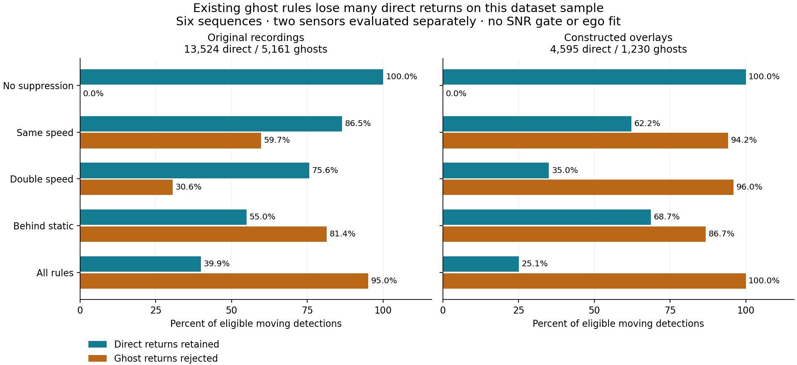

# Radar Ghost Dataset: first measured baseline, 2026-09-28

The existing point ghost rules are too aggressive when transferred directly to
this dataset. On three original recordings they retain **39.9% of eligible
direct returns** while rejecting **95.0% of specified-order ghosts**. On three
constructed overlays those figures are **25.1% retained / 100% rejected**.
High ghost rejection alone hides substantial loss of real detections.

This is an exploratory transfer test of one processing stage, **not UMRR-96
accuracy, a tracker benchmark, or a reproduction of a paper**. The live pipeline
and zero-decay display were not changed. The prior work was committed as
`d41de23` before starting this study.



## Sample, storage and provenance

The source is [Radar Ghost Dataset v1.1, Zenodo record 6676246](https://zenodo.org/records/6676246).
The [author repository](https://github.com/flkraus/ghosts) distinguishes original
recordings from overlays. The release has 111 original and 460 virtual H5
sequences. Full archives total 14,132,696,387 bytes. Data lives on the user's
Bulk-Storage drive:

```text
/run/media/jcfurey/Bulk-Storage/RadarGhostDataset/v1.1/
  archives/                 original.zip, virtual.zip (full downloads)
  sample/                   six extracted H5 members used below
  sample-manifest.json       source URLs, member CRCs and extracted SHA256
  sample-selection.json      selection decisions recorded before scoring
  zenodo-record.json         versioned publisher metadata and archive MD5
  documentation/             author README, label definitions and mirrors.zip
```

Selection used reflector descriptions and compressed size, before seeing filter
outcomes: scenarios 11 (metal containers), 13 (industrial/garage fronts), and 21
(marble wall/building). For each scenario and archive we selected the smallest
member, except virtual scenario 13, where we selected the exact example named
by MPET-GLMB. Originals are all cyclist recordings. The short overlays include
pedestrians and cyclists. This convenience sample is not population-balanced. The selected overlays
contain only 12, 28 and 12 frames per sensor; originals span 163, 252 and
184 frame indices, with two missing right-sensor frames in total. This is a
point-rule smoke test, not a long-duration tracking evaluation.

| Scenario | Original member | Virtual member |
|---|---|---|
| 11 | sequence 02, cyclist, test | 02-02-03; starts 143-037-118; test |
| 13 | sequence 02, cyclist, train | 01-05-05-06; starts 013-123-166-019; train |
| 21 | sequence 02, cyclist, train | 03-06-06; starts 001-074-006; train |

The six members used 114.4 MB compressed / 293.1 MB extracted. HTTP range reads
validated byte ranges and each ZIP member's CRC before saving an H5 SHA256.
That verifies the sampled members, not the whole archives. Both full archives completed and matched their published MD5 checksums.
The [verification record](umrr96-ghost-archives-verified-20260928.json) also
contains locally computed SHA256 hashes; its original is
`archives-verified.json` on Bulk-Storage. A `.part`, chunk or `.assembling` file
is incomplete and is not a verified archive.

The [machine-readable report](umrr96-ghost-dataset-baseline-20260928.json) contains
every exact member name, checksum, schema, setting, source-code hash, denominator,
sensor breakdown, and range/bearing breakdown. It covers **672,986 rows in
1,300 sensor/frame groups**: 615,239 original rows / 1,196 groups, and 57,747
virtual rows / 104 groups. Empty sensor frames are absent and are not counted.
Per-sensor sequences average approximately 365–769 detections per populated
scan, much denser than our last static UMRR sample's 23.25 detections per scan.

## Adapter and scoring contract

The evaluator calls the repository's `ghost_reasons()` directly. Each
`(frame, sensor)` is evaluated independently, using `r_sc`, `phi_sc`, and
`vr_sc`. Coordinates are `x=r*cos(phi)`, `y=r*sin(phi)`, `z=0` for this 2D test.
All finite measurements in the configured 0.15–120 m interval participate,
including unlabeled points. Signed radial speed is preserved on input, although
the existing speed-copy rules compare its magnitude.

The sensor is fixed, so the adapter assumes zero ego velocity and divides points
at `abs(vr) <= 0.05 m/s`, taken from the current launch YAML. The Python Doppler
class's fallback default is 0.20 m/s; that is **not** the launch setting used
here. The unchanged ghost gates are 1.5 m range gap, 0.25 m/s speed tolerance,
and 4 degrees bearing tolerance for the behind-static rule. The double-speed
rule uses twice the speed tolerance, as in the production implementation.

There is no elevation measurement, 3D ego fit, fit-validity gate, SNR gate,
tracker, obstacle persistence, or scan accumulation in this experiment. Dataset
amplitude is not silently substituted for SNR. A different noise distribution
and the missing SNR gate can materially change which points trigger a rule.
No thresholds were optimized on these recordings.

The [author's label specification](https://github.com/flkraus/ghosts/blob/main/label_convention.md)
encodes bounce order as a mask. Confident direct labels end in `11`; order
2/4/6 means specified multipath, including second-or-third ambiguity. Order 3
can include a direct return and is excluded from the binary score. Order 0
denotes unspecified multipath and is reported separately. Background, ignore,
noise, negative/uncertain annotations, groups and invalid codes never become
confident direct/ghost ground truth. The example helper's `logical_or` for a
specific type/order is unsuitable; our decoder tests independent examples.

Only valid points above the motion threshold enter the headline denominators.
495 original direct returns and 356 virtual direct returns fall below it; they
are counted separately, not interpreted as suppressed. There are no order-3 or
group annotations in this small sample, so those exclusions are covered by
tests rather than empirical cases. All observed positive labels decode.
Annotations affect scoring only; they cannot remove input clutter or create
reflector evidence for the filter.

## Ablation results

Rates are detection-weighted. Consecutive points/frames are correlated; these
are descriptive values without independent-sample confidence intervals.

| Rule enabled alone | Original direct retained | Original ghosts rejected | Overlay direct retained | Overlay ghosts rejected |
|---|---:|---:|---:|---:|
| None | 100.0% | 0.0% | 100.0% | 0.0% |
| Same speed | 86.5% | 59.7% | 62.2% | 94.2% |
| Double speed | 75.6% | 30.6% | 35.0% | 96.0% |
| Behind static | 55.0% | 81.4% | 68.7% | 86.7% |
| All | **39.9%** | **95.0%** | **25.1%** | **100.0%** |

Denominators: original **13,524 direct / 5,161 specified ghosts**; overlays
**4,595 direct / 1,230 specified ghosts**. All rules suppress 8,127 original
direct returns and 3,441 overlay direct returns. The rules overlap; adding
their rejection counts would double-count detections. Unspecified-order ghosts
are separate: all rules reject 724/730 original and 213/213 overlay points.

Original direct retention varies from 32.5% to 45.7% across these three
sequences. The same-speed rule has a better original-sample tradeoff than the
double-speed rule, but this is not sufficient evidence to pick live defaults.
The behind-static rule's large false suppression is consistent with the fact
that an isolated nearer static detection does not establish an opaque wall.
The dataset does not label every background point as a true wall, so wall
recall cannot be measured from these binary scores.

A concrete counterexample is in virtual scenario 11, frame 0, left sensor:

| Direct detection | Instance | Range | Bearing | Signed radial speed |
|---|---:|---:|---:|---:|
| Nearer pedestrian, row 879 | 17 | 8.990 m | -12.279° | +1.051 m/s |
| Farther cyclist, row 437 | 5 | 11.524 m | +13.232° | -1.184 m/s |

Their absolute speeds differ by 0.133 m/s and ranges by 2.533 m, triggering
same-speed rejection of the cyclist despite different identities, opposite
velocity signs, and 25.5 degrees bearing separation. The far detection also
triggers the other rules: removing only this one trigger would not rescue it.
This is a constructed-overlay counterexample, not an observed physical crossing.

### Sensitivity to the motion gate

A follow-up compares the existing YAML threshold (0.05 m/s) with the Python
fallback (0.20 m/s), with all other settings fixed. These two existing values
were chosen before running this comparison; no threshold search was performed.
Because a changed motion gate changes the moving-point denominator, this table
scores **all finite, in-range confident labels**, including points bypassing
the ghost rules as stationary. Its denominators therefore stay fixed: original
14,019 direct / 5,269 specified ghosts; overlay 4,951 direct / 1,294 ghosts.
These are different denominators from the headline moving-only score.

| Motion gate | Original direct retained | Original ghosts rejected | Overlay direct retained | Overlay ghosts rejected |
|---|---:|---:|---:|---:|
| 0.05 m/s | 42.0% | 93.1% | 30.5% | 95.1% |
| 0.20 m/s | 56.9% | 89.0% | 57.3% | 86.2% |

The transfer result depends materially on this gate, yet both choices suppress
many direct returns. This supports revisiting the evidence behind rejection;
it does not establish a replacement live threshold. See the
[sensitivity counts and provenance](umrr96-ghost-threshold-sensitivity-20260928.json).

## What the full-text paper reading changes

**Pegoraro and Rossi (2021), sections IV-A and IV-C–E:** their DBSCAN uses XY
only, explicitly because body-part velocities and powers differ. Covariance
conversion and global association are the better-supported components to
borrow. For polar range/bearing uncertainty, our candidate Cartesian covariance
is `J R_polar Jᵀ`, where `J=[[cos(phi), -r*sin(phi)], [sin(phi), r*cos(phi)]]`.
Use calibrated measurement noise or justified floors; SDK variance units and
calibration remain unresolved.
The paper's association score uses innovation covariance and a global Hungarian
assignment. Its close-track deletion would conflict with our crossing-person
case. A strict per-point Doppler grouping gate needs its own fragmentation
test, not a citation to this paper as proof.
[Full text](https://arxiv.org/html/2105.11368).

**MPET-GLMB (2026), sections III, IV-C and V-C:** its range/bearing/radial-speed
measurement model fits our exposed feature types. It reasons jointly about
targets, reflectors and propagation paths, rather than treating matching speed
as sufficient proof of a ghost. Static-return line initialization still needs
geometric support that sparse wall returns may not provide. The exact V-C
sequence is confirmed in `virtual.zip`; its multitarget motion is an overlay.
Its reference positions are means of direct radar returns, not independent pose
measurements. These limit how strongly its example establishes crossing and
absolute localization performance. We have not reproduced its tracker.
[Full text and sequence footnote](https://arxiv.org/html/2602.03464v2).

Section II-A also gives a useful physical check: its two-bounce range and
Doppler are averages of the direct and mirrored-path values. Our inference is
that generic second-bounce returns should not be expected to have twice the
direct radial speed; reflector geometry matters.

**RISE:** its transmit/receive complex-signal front end remains incompatible
with our audited target-list interface. It is a reference for inferred layout,
not a way to recover missing measured wall points from these rows.
[Full text](https://arxiv.org/html/2511.14019v5).

**Gao et al. (2026):** an open-access PMC copy resolved the earlier publisher
retrieval failure. Section 4.3.1 compares each neighbor's signed radial velocity
and position with the growing cluster centroid, updating that centroid after
acceptance. This is a sequential cluster gate, not a universal pairwise Doppler
distance. Candidate validation then rejects clusters below minimum count,
centroid speed or mean SNR; the simulation uses seven points minimum. Copying
those exclusions would threaten sparse or stationary-person observations here.
Section 4.4 retains unassigned points for possible initiation and includes
association-conflict handling. Reported runtime comes from different benchmark
settings; it is not a latency guarantee on our host. The data statement provides
no downloadable experiment archive. Test the grouping idea independently before
adopting its validation gates.
[Full text, sections 4.3–4.4 and 5.2.5](https://pmc.ncbi.nlm.nih.gov/articles/PMC13306346/).

PGA-TCN remains abstract-level screening; no code or numerical gate is being
adopted from its abstract. See the
[earlier shortlist](umrr96-paper-shortlist-20260928.md) for that source link.

## Next experiment

The [rejection-criteria follow-up](umrr96-rejection-criteria-20260928.md) now covers
53 recordings from the other 18 source scenes and replays the recorded UMRR walk.
It tests signed-speed/direction/support hypotheses and adds an optional
static-only advisory policy, retaining the original live default. The broader
association and reflector-model experiments below remain future work.

Preserve all current-scan measurements and keep a suspected/ambiguous label when
path evidence is weak. First compare covariance-aware global association with
the current association, holding clustering fixed. Separately compare optional
signed-Doppler grouping with a position-only baseline and measure both merged
people and fragmented people. Then evaluate a reflector-supported ghost score
against today's three rules. These are proposed experiments, not implemented
filter changes from this study.

Use the remaining source scenarios for independent evaluation. Split by scene
and original source recording: train/test filenames alone do not make a new
experiment independent if its overlays reuse training sources. A larger dataset
run should report pedestrians/cyclists, sensor, reflector type, range, motion
state and sequence-level variability separately. Physical crossings, standing
people and oblique steel-wall visibility still require controlled UMRR captures.
Internal track history may inform today's label without displaying old XYZ.

## Reproduce

Use [the assessment commands](../tools/assessment/README.md#radar-ghost-dataset).
The eight adapter tests check label masks, unspecified-order cases, group
exclusion, source isolation, invalid measurements, scoring denominators and
annotation independence. No ROS installation or powered radar is required.
