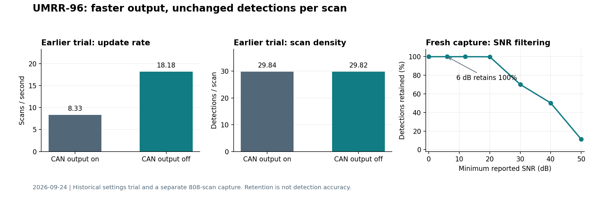
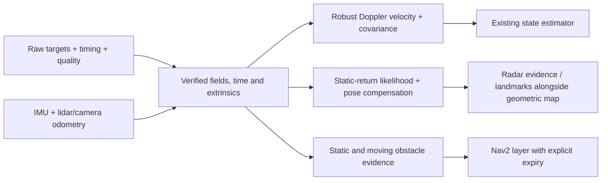

# UMRR-96 density, filtering and navigation investigation

2026-09-24. Scope: the connected **UMRR-96 Type 153**, serial 230739
(`0x38553`), helping lidar/camera/IMU navigation. Driver revision inspected:
`3e3bbda`; Smart Access Automotive 3.13.0, UIF 1.2.2, ROS 2 Lyrical.
Live status readback confirmed firmware **5.2.2**. The local compatibility table
lists 5.2.4 for this interface; the exercised streaming path works, while
unexercised firmware features still need confirmation.

**Yes, useful temporal density can increase, and the available fields support
better filtering. Navigation benefit remains a testable hypothesis.** The best
first application is Doppler velocity aiding plus additional obstacle evidence.
Dense, lidar-like surface reconstruction is a substantially harder objective.
This investigation establishes stream integrity and identifies integration
issues; it does not establish obstacle detection accuracy or motion accuracy.

The sensor-specific findings use the existing
[workspace reference collection](../../../references/smartmicro_umrr96/README.md),
local driver source, previous hardware experiments and a new passive recording.
Published research is used to assess candidate methods, not to transfer another
radar's performance claims to this unit. No sensor settings, running driver,
network configuration or robot motion were changed.

The new evidence is reproducible:

- [Live capture analysis](umrr96-assessment-20260924.json): statistics, source
  hashes, metadata checks, filter comparisons and Doppler consistency checks.
- [ROS graph and readback context](umrr96-context-20260924.json): publisher
  counts, confirmed status values and parameter-read failures.
- [Offline assessment tools](../tools/assessment/README.md): commands,
  assumptions, a numerical test suite and plot generation.
- [Original MCAP directory](../../../results/umrr96-investigation-20260924/live/):
  approximately 4.7 MB, retained locally under the workspace's ignored `results/`.
  The raw recording is not added to Git.

The capture spans **22:44:48.835–22:45:33.291 UTC** on September 24. This was an
observational sample of an unspecified scene, without a labeled obstacle fixture
or reference trajectory. Small measured Doppler values are consistent with little
radial motion; they do not independently establish that the sensor was stationary.

| Measurement in the new capture | Result | What it establishes |
| --- | ---: | --- |
| Raw scans / detections | 808 / 21,451 | Enough data for a short stream audit |
| Scan rate | 18.153 Hz | The present stream is already near the prior 18.18 Hz fast setting |
| Detections per scan | Mean 26.55; range 21–33 | Sparse instantaneous target lists, about 482 observations/s |
| Core fields finite | 21,451 / 21,451 | XYZ, range, angles, speed and SNR are numerically usable |
| Matching header/timing/quality messages | 808 / 808 for each | Counts and quality array lengths agree for every captured scan |
| Filtered versus raw point bytes | Identical in all 808 scans | Current quality filtering removes nothing in this sample |
| Kernel UDP drops | Counter remained zero in 44 diagnostic samples | No observed kernel socket overflow; not proof of zero loss everywhere |
| Receive interval | Median 55.003 ms; maximum 57.049 ms | Consistent short-window delivery |
| Device/ROS timestamp reversals or repeats | None in the captured stream | Counters advance consistently over this window |
| Local recorder delay after cloud stamp | Median 0.140 ms; p95 0.203 ms | Fast local delivery, **not** acquisition-to-host latency |
| Reported SNR | Minimum 18.24 dB; median 40.51 dB | The current 6 dB host threshold cannot reject these points |
| Range | 2.922–19.321 m | Returns present in this scene; no minimum-range validation |

The graph had **zero `/tf` and `/tf_static` publishers**, and no IMU, odometry,
lidar or camera data topics. The view reported sensor-frame accumulation and
`ego_motion_compensated: false`. All raw Pfa and flag values were zero, explicitly
marked unverified. The four SDK variance fields were finite and positive, but
their units, calibration and unavailable-value conventions remain unresolved.

Status reads succeeded. A full parameter read and a later small read of seven
relevant settings both timed out. The target stream continued during the full
read failure. Therefore this report does **not** infer the current CAN, sweep,
PRF or synchronization parameter values from the frame rate or opaque setup
word. Reliable readback is required before further hardware comparisons.



The figure deliberately keeps the earlier setting comparison separate from the
new scene. Its last panel measures retention, not filtering accuracy.

There are three different meanings of “denser,” with different limits:

| Meaning | Available route | Evidence and limitation |
| --- | --- | --- |
| More measurements per second | Disable unused CAN target output in an Ethernet-only setup | Earlier hardware trial: 8.33 → 18.18 Hz, approximately 2.18×; mean targets/scan stayed 29.84 → 29.82. The new capture is already at this faster rate; another 2× gain is not established. |
| More useful returns across time | Transform each scan with calibrated pose and time, retain appropriate static returns, merge over a bounded interval | Implementable with the existing target fields. Repeated hits add evidence, not necessarily unique points or independent measurements. |
| More independent detections or finer separation in one scan | Waveform/antenna selection, vendor processing options, or different acquisition hardware | Current SDK exposes no general CFAR/SNR detection threshold, raw ADC, radar cube or accessible peak-list stream. Host filtering cannot recover discarded sensor detections. |

The [earlier hardware trial](umrr96_38553_tuning.json) used interleaved returns
to baseline. Its timing change followed CAN output disable/restore, while neither
alternate antenna provided a clear near-field density gain. Medium sweep extended
observed range to about 53.8 m but reduced returns inside 5 m from roughly 6–7 to
2 per scan in that scene. PRF and velocity validation controls exist; there is no
measured winning PRF. Wider speed gates only help if useful targets are currently
being rejected. Alternating short/medium sweeps shares acquisition time; it does
not provide each mode at the full combined frame rate.

The local parameter definition contains 29 controls. Object-output enables have
maximum zero, and the stream interface has only target/base-target callbacks.
The optional collision-avoidance firmware product is not a missing generic ROS
topic. Native thresholds, raw data access and optional firmware capabilities
require a vendor answer for this serial and firmware. These conclusions can be
checked in the [capability inventory](umrr96-output-priorities.md) and
[SDK stream interface](../../../references/smartmicro_umrr96/smart_access/include/umrr96_t153_automotive_v1_2_2/DataStreamServiceIface.h).

The [local datasheet, p. 11](../../../references/smartmicro_umrr96/pdfs/umrr96_type153_datasheet_2020-11-11.pdf)
specifies short/medium/long ranges of 0.15–19.3 / 0.4–55 / 0.8–120 m and range
separation below 0.3 / 0.6 / 1.2 m. Its typical angular accuracy figures are
1° azimuth and 2° elevation under stated high-SNR/angle conditions; **angular
separation is separately listed as approximately 30°, optional**. Accurate
location of one reflector does not imply resolving two nearby reflectors at the
same range and Doppler. This distinction matters more than RViz point size or
grid resolution.

For scale, a 1° direction error at 20 m corresponds to roughly 0.35 m lateral
error; 2° corresponds to about 0.70 m vertically. These are geometric examples,
not calibrated covariance estimates. A 0.25 m displayed cell cannot establish
0.25 m physical accuracy. Accumulation improves repeatability and coverage only
to the extent that pose, timing and return association are correct.

At the current rate, a **0.3–1.0 s** accumulation experiment would combine about
5–18 scans. Use timestamped odometry, preserve point ages and uncertainty, cap
repeated contributions, and expire moving/unconfirmed returns. Measure unique
supported cells and surface error rather than maximizing point count. The
existing fixed-frame density view is a useful debugging step, but its hit counts
are not occupancy probabilities. Synthetic aperture, coherent integration and
signal-domain super-resolution require information absent from these lists.

Filtering is feasible at the **detection level**. The callback already preserves
XYZ, radial speed, power, noise, SNR, RCS, angles, range and four variance values.
Power/noise are described as dB; the source computes SNR as their difference.
The local field documentation does not establish absolute power in dBm or a
complete calibrated RCS contract. Inspect the [target accessors](../../../references/smartmicro_umrr96/smart_access/include/umrr96_t153_automotive_v1_2_2/comtargetlist/Target.h)
before assigning physical meaning to these values.

A concrete ROS integration issue appeared in the fresh data:

```python
# Drops every point in this capture because an optional field is NaN:
read_points(cloud, skip_nans=True)

# Select the measurements actually required by the algorithm:
read_points(cloud, field_names=('x', 'y', 'z', 'radial_speed', 'snr'),
            skip_nans=True)
```

All 21,451 points have an unavailable `false_alarm_probability` sentinel. A
generic all-fields finite check therefore rejects good XYZ/Doppler measurements.
Keep unknown quality fields unknown; fixing a consumer is preferable to inventing
confidence in the source message. Also map `radial_speed` explicitly when an
algorithm expects a field named `doppler`. Verify sign, units and coordinates
with controlled motion before connecting a velocity estimator.

Replaying the existing filter implementation on the recorded raw scans gives:

| Host filter / threshold | Retained detections | Interpretation |
| --- | ---: | --- |
| Off | 100% | Baseline |
| Quality, SNR ≥6 dB | 100% | No filtering effect in this sample |
| Stable mapping, default two-of-three scan confirmation | 94.76% | Rejects 1,124 detections, including initial history warmup; their correctness is unknown |
| Moving returns, absolute radial speed ≥0.25 m/s | 0% | Removes all these potential static landmarks |
| SNR ≥20 / 30 / 40 / 50 dB | 99.90 / 70.16 / 50.19 / 11.11% | Higher cutoff reduces count; no evidence it preferentially removes ghosts |

The existing mapping confirmation operates in the sensor's range/azimuth frame
and assumes a still radar. A moving platform needs pose-aware association.
Absolute radial-speed thresholding does not distinguish static world geometry
from moving objects on a moving robot, and purely lateral movers can have small
Doppler. Filtering by SNR alone also cannot reject strong multipath.

| Candidate method | Evidence level | Fit to this driver |
| --- | --- | --- |
| Finite-field checks, calibrated region/height limits and modest SNR gating | Established preprocessing | Available now; avoid removing zero Doppler landmarks or gating every optional field |
| Robust Doppler fit using RANSAC followed by robust/weighted least squares | Demonstrated radar-inertial method | Strong first candidate; needs verified sign, extrinsics, synchronization, geometry checks and covariance calibration |
| Pose-compensated temporal confirmation and clustering | Established tracking/mapping techniques | Better suited to a moving robot than current sensor-frame persistence; uncertainty must grow with range |
| Calibrated radiometric features and RCS-weighted registration | Demonstrated in other radar research | Feasible after validating RCS/gain conventions; transfer to Type 153 is unproven |
| Geometry-informed multipath likelihood | Research candidate at target-list level | Lidar planes, temporal geometry and Doppler can supply evidence; a high-power return is not automatically direct-path |
| Learned confidence from radiometry, Doppler and persistence | Proposed experiment here | Requires labeled training data, held-out scenes and comparison to simpler baselines |
| CA/OS-CFAR, beamforming, phase-coherent denoising and DOD/DOA tests | Established signal-processing methods | Cannot be correctly rerun from this API's thresholded targets alone |

[Doer and Trommer's radar-inertial work](https://christopherdoer.github.io/publications/2020_09_MFI2020)
demonstrates RANSAC ego-velocity estimation fused with IMU measurements. This
supports the approach, not an accuracy guarantee for this sensor. For RCS,
[Radar4Motion](https://github.com/ailab-hanyang/Radar4Motion) provides an implementation
of dynamic filtering and RCS-weighted matching. The newer
[RCS Gaussian modeling work](https://arxiv.org/abs/2604.14868) is an extended
workshop abstract, so it belongs in an exploratory comparison. The
[multipath GLRT paper](https://arxiv.org/abs/2309.13585) exploits separate departure
and arrival angles in MIMO observations; those are not supplied by this driver.
Calling a target-list heuristic an implementation of that detector would be wrong.

Radiometric filtering should start with calibration. In the ideal monostatic,
far-field point-target model, received power scales with RCS and inverse fourth
power of range, with transmit/receive antenna gains and system losses also
present. See the [MIT Lincoln Laboratory radar material](https://www.ll.mit.edu/media/6966).
If a field truly represents uncorrected received power, a relative correction
has the form `power_dB + 40 log10(range/reference_range) - gain_correction_dB`.
This is a model to test, **not a correction to apply blindly to the existing RCS**.
The firmware may already perform range/gain compensation, and near-field,
extended-target, aspect and multipath behavior depart from that model.

Measure known reflectors and ordinary obstacles at multiple distances, angles,
orientations and sweep settings. Estimate systematic bias and repeatability;
retain uncertainty rather than declaring a universal intensity cutoff. The fresh
`rcs` values span approximately 0.00082–240,687 in unspecified SDK units. This
alone argues against giving unbounded influence to large RCS values. Verify
linear versus logarithmic conventions before conversions; use capped robust
weights and separate calibration for each relevant sensor configuration.

A plausible novel experiment is a bounded static-return probability using
SNR, calibrated RCS, range/angle, normalized Doppler residual and pose-compensated
repeatability. Lidar/camera geometry can supply weak labels **where visibility and
alignment are established**; their missing returns must remain unknown, especially
for glass or degraded visibility. Compare a simple logistic model and a small
tree model with the geometric baseline. Split by route/session, not adjacent
frames, and require improvements on scenes excluded from fitting. This is a
proposed combination, not a claim of research novelty or proven performance.

For a world-static reflector with unit bearing `u_i`, and **assuming positive
receding Doppler**, the useful constraint is:

```text
d_i = -u_i^T v_radar + noise
e_i = d_i + u_i^T v_radar

v_radar_in_radar = R_body_from_radar^T
                  (v_body_in_body + omega_body_in_body × p_body_to_radar)
```

The second line provides a motion-consistency residual; the last line includes
the mounting lever arm during turns. Small residual is evidence compatible with
a stationary return, not proof: ghosts and tangential movers can also agree.
Estimate velocity only when static consensus and bearing diversity are adequate,
and reject or inflate covariance when the system is poorly conditioned. A single
scan's Doppler measures radar translational velocity, not independent absolute
yaw or full six-degree-of-freedom pose. Use IMU/other odometry for orientation and
pose propagation. Do not report unobserved components with zero uncertainty.

The offline audit's exploratory planar fit succeeds numerically on all 808
scans. Median condition numbers of the bearing matrix are **1.84 in XY** and
**6.38 in XYZ**. These are conditioning measures, not uncertainty estimates.
Fitted speeds are nearly zero and median Doppler residual RMSE is about
0.0012 m/s. **That is not measured velocity accuracy**: every Doppler magnitude
is below 0.017 m/s, all pass the exploratory 0.30 m/s consensus gate, and there
is no reference motion. The test shows numerical compatibility, not meaningful
dynamic-outlier rejection or odometry performance.

Time calibration is likely more important than adding another intensity gate.
Cloud stamps are ROS callback receive time. The datasheet specifies processing
latency of 2–4 cycles; at a 55 ms cycle that is an illustrative 110–220 ms.
At 1 m/s, such a delay corresponds to 0.11–0.22 m of translation. At 20 m range
and 30°/s yaw, it could contribute approximately 1.15–2.30 m of lateral error.
These are examples, not a measurement of this unit's delay. A fixed 110 ms
subtraction is not justified. Establish device-clock mapping and processing
delay across settings, or estimate time offset against independent motion.
[Temporal-calibration research](https://arxiv.org/abs/2502.00661) demonstrates why
this belongs in the estimator. Frame compensation is not per-point deskewing;
no verified per-target acquisition times are currently available.

For the requested assisting role, implement three separate outputs after the
measurement adapter. This avoids discarding moving hazards merely because they
are unsuitable static landmarks:



Use `geometry_msgs/TwistWithCovarianceStamped` for validated velocity aiding,
with an explicit frame and calibrated observable covariance. The existing state
estimator should retain ownership of the main odometry/TF chain. Avoid fusing
correlated radar/IMU information twice as if independent. Algorithms such as
[x-RIO](https://github.com/christopherdoer/rio/tree/main/x_rio) and
[ETH's sparse RIO](https://github.com/ethz-asl/rio) are useful references, but their
documented entry points use ROS 1; their launch instructions and point schemas
are not drop-in ROS 2 adapters for this cloud.

For mapping, maintain radar evidence/landmarks separately from the lidar surface
model initially. Use an inverse sensor model with broad, calibrated angular
uncertainty, bounded evidence updates and time decay. Do not feed this sparse
cloud into lidar ICP/TSDF with lidar noise assumptions. Do not turn the fan image
or empty density cells into measured surfaces or free space. A learned or
Gaussian representation can represent uncertainty; it cannot create measured
geometry absent from the radar observations.

For navigation, [Nav2 accepts PointCloud2 obstacle sources](https://docs.nav2.org/rolling/configuration_and_development/configuration_guide/core_servers/costmap_2d/costmap_plugins/obstacle/).
A first offline integration can mark credible radar obstacle evidence while
keeping lidar/depth as the main free-space source. Use `clearing: false` for
radar raytracing: a missing radar return does not demonstrate free space, and
reflections can come from beyond an intervening object. Explicitly test height
and ground rejection, limited field of view, blind areas and newly appearing
obstacles. Temporal confirmation should not unnecessarily delay the first
credible hazard indication.

**Obstacle lifetime must be implemented explicitly.** Nav2's
`observation_persistence` is the lifetime of buffered observations, not a TTL
that erases already marked cells. A mark-only radar layer otherwise risks
persistent false obstacles. Use a layer that expires its own evidence and
recomputes costs, or an explicitly tested clearing policy with the other sensors.
Check clean removal after a moving object leaves and after radar disconnection.

To prove usefulness, define the operating envelope and run paired comparisons.
For initial planning only, a low-speed ground robot (up to about 1 m/s) and
0.5–15 m region of interest are reasonable test assumptions, **not established
requirements or certified operating limits**. Include metal, wood/plastic,
people/legs, poles, walls, glass, oblique surfaces and clutter, plus locations
with few static reflectors. The current sample does not cover these cases.

| Experiment | Evidence needed | Result required before claiming usefulness |
| --- | --- | --- |
| Sensor/transport baseline | Longer bags, configuration snapshots, frame counters, diagnostics, disconnect/reconnect | Account for missing frames and time resets; no silent stale outputs; sustain the application update rate |
| Geometry and radiometry | Surveyed reflectors and obstacles at known range/angles, repeated over aspect and settings | Calibrated biases/uncertainty, detection probability and false detections per region; characterize close-range failures |
| Time and extrinsics | Radar rigidly mounted with IMU and reference sensor; translations and turns in both directions | Verify axis/Doppler signs, lever arm and temporal alignment; choose the allowed time error from the map error budget |
| Velocity aiding | Reference velocity during starts/stops, forward/reverse motion, turns, lateral motion and moving distractors | Report velocity bias/RMSE/p95 error, estimate availability, outlier rate and covariance coverage |
| Mapping contribution | Repeated passes against an independent reference map, before/after compensation | Improved supported coverage at matched false-occupancy rate, plus surface error, ghost persistence and moving-object trails |
| Navigation contribution | Identical recorded scenarios, then supervised physical runs with the existing navigation stack | Useful earlier hazard detections or fewer localization failures without increasing missed hazards or false stops |

Record raw targets, target headers, device timing, raw quality, diagnostics, actual
settings, IMU, lidar/camera, independent reference pose, odometry and TF together.
Start with stationary holds, known straight motion and deliberate turns; then
repeat routes with dynamic objects and sensor-degradation intervals. Public
datasets can validate an implementation, but cannot validate this radar's field
semantics or error model.

Run these configurations on the **same bags**: existing lidar/camera/IMU baseline;
baseline plus lightly gated radar; plus Doppler/temporal consistency; plus
calibrated radiometry; and the proposed learned method. Keep an untouched set of
routes and physical targets. Compare ATE/RPE, velocity error, false obstacles,
hazard recall, time to detection, false stops, navigation completion, CPU and
end-to-end age. Count failures, not only successful segments. Estimate uncertainty
across independent runs rather than treating correlated radar points as trials.

Example project gates to agree before collecting the benchmark: ≥95% recall for
the explicitly chosen obstacle classes/ranges; velocity RMSE ≤0.10 m/s with
credible uncertainty; ≥20% reduction in a selected trajectory/velocity error
metric during planned lidar/camera degradation, with ≤5% regression under normal
conditions. These are **proposed acceptance criteria**, not measured results or
universal radar requirements. Numerical targets should change with speed,
stopping distance, footprint and map resolution. Report confidence intervals and
adequate independent test coverage, not just whether the mean passes.

An independent reference is essential. Motion capture, surveyed fiducials or a
well-characterized reference trajectory can provide it. Clear-scene lidar
odometry can be a useful provisional reference, with its own errors acknowledged.
Do not build an accumulated radar map using a lidar trajectory and then treat its
agreement with that same trajectory as proof of independent radar odometry.

The immediate engineering order is: restore dependable readback; verify consumer
field selection; record synchronized, controlled motion; calibrate time/extrinsics
and Doppler; implement robust velocity aiding and pose-aware return association;
then compare radiometric weighting and obstacle evidence. Pursue the more complex
learned/modeling methods only if they outperform these baselines on held-out runs.
If the requirement is substantially finer per-scan geometry, resolve vendor raw
data/processing access before spending effort on software densification.

The added audit's four numerical tests pass, including recovery of known
translation with injected Doppler outliers and rejection of unobservable bearing
geometry. The real MCAP passes the metadata/count/byte-preservation checks above.
Those tests validate the assessment calculations and observed transport behavior;
**ROS 2 navigation, mapping and moving-platform odometry remain unvalidated on
this physical setup**.

Implementation follow-up, September 24: the standalone
[sensor description](../smartmicro_description/README.md) now supplies the
measurement-frame contract. The first
[processing iteration](../smartmicro_processing/README.md) implements selected-field
validation, byte-preserving quality subsets, robust 3D Doppler fitting with
geometry/consensus checks, experimental covariance, residual classification and
stale-data handling. Its 29 pytest cases, 808-scan replay and 181-scan live check
establish software behavior and local throughput. The live estimates remain on
a separate experimental topic; physical sign/time/extrinsic/covariance calibration,
dependable tuning readback, pose-aware accumulation and navigation benefit remain
open parts of the validation plan above.
