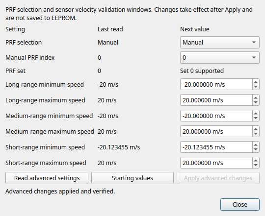

# UMRR-96 output improvements

2026-09-24; sensor 230739 (`0x38553`, label ending 8553), Type 153,
last verified firmware 5.2.2, Smart Access Automotive 3.13.0 / UIF 1.2.2.

The goal is to recover useful sensor information and measure actual detection
quality. Accumulating hits in a grid does not increase the sensor's resolution.
The operator reported that the radar itself was moving during this work.

## Priority status

| Priority | Implemented or established | Remaining evidence needed |
| --- | --- | --- |
| 1. Sensor processing controls | Typed PRF and per-sweep velocity-validation writes, an advanced RViz dialog, and a measurement tool with verified restoration | Live float-write/readback and PRF comparison through the working control endpoint; repeatable scene for selecting a setting |
| 2. Native firmware outputs | Capability inventory below distinguishes existing targets, optional firmware products and unavailable SDK streams | Vendor confirmation for this serial/firmware, optional tracking/grid availability and protocol |
| 3. Quality semantics | Four existing variance fields and peak index preserved; new raw quality topic retains Pfa/flags without assigning confidence | Field validity, variance units/calibration, flag definitions and acquisition-setup layout |
| 4. Timing and moving radar | Optional timestamped TF accumulation in a fixed grid frame; bounded TF wait; quality-only filtering; delay-variation diagnostics | Real odometry/TF, calibrated sensor pose and verified acquisition-clock synchronization |
| 5. Receive losses | Per-socket kernel drops and receive memory, matched to this process; deliberate overflow regression | SDK assembly/drop counters and internal queue depth remain unavailable through the audited API |

During offline implementation, the original driver, control process, views and
RViz were left running. A fresh profile read timed out; a subsequent liveness
check received no targets and the Ethernet neighbor for 192.168.11.11 was
`FAILED`. No sensor setting was written by the implementation or measurement
attempts. The ROS graph had no odometry publisher. The radar subsequently
reconnected, and the operator authorized restarting the session with the tested
build under `.colcon/umrr96-no-wrapper` in the workspace; see verification below.

## 1. Controls and repeatable measurements

`smart_radar/set_radar_mode` in the **separate readback node** now accepts these
additional volatile controls in section `auto_interface_0dim`:

| Name | Service `value_types` | Accepted values |
| --- | --- | --- |
| `prf_selector_manual` | 3 (u8) | 0 automatic, 1 manual |
| `prf_set_selector` | 3 (u8) | 0 only, as specified by this UIF |
| `prf_manual_value_idx` | 3 (u8) | 0–2; physical PRF frequencies are not established here |
| `tv_min_speed_sweep_idx_0/1/2` | 0 (f32) | −150 to +150 m/s |
| `tv_max_speed_sweep_idx_0/1/2` | 0 (f32) | −150 to +150 m/s |

Sweep indices 0, 1, 2 correspond to long, medium, short range. Each changed
velocity window must supply **both** bounds with minimum ≤ maximum. All values
are validated before sending any instruction: malformed strings, NaN, infinity,
wrong types, unknown names, duplicate names and inconsistent windows are rejected.
The sensor batch is not an atomic transaction; always read back every written
value, including after an ambiguous timeout. These gates can discard targets;
widening them does not promise more valid detections.

The existing antenna, sweep, range switching and CAN-output controls remain
available. The RViz panel's **Advanced sensor controls…** button opens a separate
dialog for PRF selection/index and velocity bounds for all three sweeps. The
fixed PRF set is read back and displayed without an unsupported selector.
Network, persistence, synchronization and disabling the Ethernet target stream
are outside this tuning service. It does not save settings to EEPROM.

Opening the dialog reads settings without writing them. Edits are staged, and
**Apply advanced changes** reads the current settings again before sending
anything. If another client has changed them, the panel shows those actual
values and sends no writes. PRF index changes are made while selection is
automatic; the requested selector is applied afterward. Each changed velocity
window sends both bounds with float types. Invalid windows disable Apply.
Unedited values retain their original float precision even if the editor's
display rounds them.

After all writes, the dialog verifies the full advanced profile. Rejection or
timeout stops the remaining writes and triggers a fresh read: the panel shows
any partially applied state instead of claiming success. **Starting values**
stages the first advanced profile read for this sensor during this panel session;
Apply verifies and restores it. Closing the dialog does not restore settings.
Changing the sensor ID clears both basic and advanced starting profiles.



After sourcing a build containing these changes:

```bash
# Read-only: all 29 parameters, 14 statuses and a raw detection measurement.
ros2 run umrr_ros2_driver umrr96_measure \
  --scene moving --seconds 10 --output /tmp/umrr96-baseline.json

# Volatile experiment: interleaved automatic/manual PRF windows and restoration.
# Use a repeatable scene; do not change settings from another client during it.
ros2 run umrr_ros2_driver umrr96_measure \
  --prf-trials --scene stationary --seconds 20 --output /tmp/umrr96-prf.json
```

Use `--scene moving` for an exploratory moving run; it is recorded as such, and
the tool never selects a "winning" setting automatically. Each PRF window
settles for two seconds, records actual settings, raw detections per frame,
near-field counts, SNR/range/speed distributions, sensor cycle, device intervals
and acquisition-setup words. Automatic baselines are interleaved with manual
indices 0, 1 and 2. The original PRF state is restored and read back in `finally`,
including after partial writes, missing data, exceptions and interruption.
Unrelated setting changes abort the comparison and are not overwritten during
restoration. The tool writes its restore values to the JSON report before the
first write and refuses to overwrite an existing report file.

Loss of power/connectivity can prevent restoration; the report explicitly says
`failed` in that case. A hard kill cannot run `finally`: use the recorded
`restore_values` to restore through the service after reconnecting. Do not treat
an experiment as complete unless its restoration was verified.

## 2. Capability inventory for this hardware

| Output/control | Evidence | Conclusion |
| --- | --- | --- |
| Ethernet target list, port 2.1 | Real capture replay and live target stream | Supported; current primary input |
| Compact target list / CAN serialization | UIF callbacks and serialization definitions | Supported interface family, not a denser raw acquisition stream |
| Four variances, peak index, acquisition setup | 30 captured frames / 953 targets in the SDK audit | Available and preserved |
| Pfa and flags getters | Both zero throughout that real capture; nonzero synthetic decoder fixture also tested | Preserve raw values; their firmware meaning remains unverified |
| Object output enables | Both object controls have minimum = maximum = 0 in UIF 1.2.2 | No supported enable value for optional tracking in this interface |
| Native collision-avoidance grid | Type 153 datasheet describes a separate firmware product/option | Not a missing generic ROS topic we can enable with the present controls |
| ADC, range-Doppler cube, raster intensity or peak list | No corresponding UMRR-96 callback in the supplied stream interface | Not exposed by this SDK interface; `peak_idx` alone does not expose the peak list |
| CFAR/SNR detection threshold | No such parameter in the 29-entry definition | Host SNR filtering cannot recover detections suppressed inside the radar |

The [Type 153 datasheet](https://www.smartmicro.com/fileadmin/media/Downloads/Automotive_Radar/Sensor_Data_Sheets_76-81GHz/UMRR_Automotive_Type_153_Data_Sheet.pdf)
describes optional tracking/collision-avoidance products and short-range operation.
The upstream compatibility table pairs UIF 1.2.2 with firmware 5.2.4; this unit
last reported 5.2.2. Successful decoding/readback does not prove all optional
firmware features are compatible. No firmware update was attempted.

Vendor questions to resolve before implementing native optional outputs:

1. Which firmware/license options are supported by serial 230739, and can native
   tracking or collision-avoidance grid coexist with this Ethernet target list?
2. What are their port definitions, supported SDK version, frame convention,
   timestamp contract and enable/readback sequence?
3. Are lower detection thresholds, peak-list output or raw range-Doppler data
   available on this hardware? What are their bandwidth and processing limits?
4. What do Pfa, each flag bit and the acquisition-setup bits mean on 5.2.2/5.2.4?
   What marks each field unavailable, and are the four variances calibrated in
   m², (m/s)² and rad²?
5. What is the acquisition timestamp epoch/unit and relation to target processing
   latency? How are synchronization lock, loss and clock reset reported?

## 3. Raw quality without invented confidence

The optional `smart_radar/umrr96_raw_quality_N` topic contains
`Umrr96RawQuality`: the cloud's identical header, sensor ID and per-target arrays
of raw SDK Pfa and flag values. Its `semantics` is explicitly
`SEMANTICS_UNVERIFIED`. It is published when subscribed, for the UMRR-96 Ethernet
target-list callback. Arrays follow the **raw** cloud's order, not a filtered
cloud's order. Match by header stamp/frame ID.

The existing 18-field / 72-byte cloud layout and its Pfa/flags sentinels remain
compatible. Variances and peak indices are still copied without scaling; the
new raw topic makes uncertain fields inspectable without silently promoting
zeros to validated confidence. No variance-weighted filtering or acquisition
bit decoding is applied without the missing definitions.

## 4. A grid that can follow a moving radar

Set the views node's startup parameter `grid_frame_id: odom` when a calibrated,
timestamped `odom -> ... -> umrr96` TF chain is available. Empty/default keeps
the sensor-local grid. Only density cells and density markers change frame;
the raw cloud, filtered cloud, instantaneous fan/image and range guides retain
their sensor frame. Set RViz's fixed frame to `odom` when viewing world-fixed
density. Prefer a continuous odometry frame; clear density after localization
resets or map-frame corrections.

Transforms use each cloud's exact header stamp, including translation, yaw,
pitch and roll before flattening world XYZ into the 2D grid. Missing TF waits
up to `tf_wait_seconds` (default 0.25 s) in a bounded 40-scan queue. Expired,
overflowed and zero-stamp scans are counted and omitted from the grid. There
is no silent identity/latest-TF fallback. The instantaneous fan still works.
Delayed hits retain decay appropriate to their original receive time; resetting
the density also clears pending scans.

Density decay is adjustable at runtime through `decay_seconds` (0.1–30 s,
default 2 s) or **Density decay → Apply view settings** in RViz. Changing only
decay keeps accumulated hits and temporal-filter confirmation history. Existing
and TF-pending hits retain the decay accrued before the change, then fade at
the new rate. Invalid values reject the entire parameter batch. The current
time constant is included in `/smart_radar/filter_status`; the fan/image still
shows only the latest scan. This is an exponential time constant, not a fixed
hit lifetime: a single hit falls below the 0.25 removal threshold after about
1.39 time constants, and repeatedly hit cells persist longer.

Cloud stamps remain **ROS receive time**, not calibrated acquisition time.
This enables approximate pose compensation but retains sensor/transport latency
error. The datasheet's multi-cycle processing latency cannot be corrected by
assuming one universal constant. No time-sync settings are changed.

Filtering is selectable as `off`, `quality`, `mapping` or `moving`, also exposed
in RViz. `quality` applies only finite-value/SNR gates and retains zero-speed
returns without scan persistence, which is useful while carrying the radar.
`mapping` still assumes a stationary radar for its temporal confirmation;
`moving` still thresholds **sensor-relative** radial speed. World-fixed grid
coordinates alone do not compensate Doppler or identify independently moving
objects. Odometry, sensor extrinsics and timestamp validation are prerequisites
for adding that interpretation.

## 5. Visibility into missing or delayed data

Each Ethernet adapter now has a `UDP adapter N` diagnostic. On Linux it matches
the configured local port against socket inodes owned by this driver process,
then reads that socket's kernel drop counter and queued receive memory. Counter
increases raise WARN; unsupported/unavailable/ambiguous counters raise WARN and
`kernel_counters_available=false`, rather than reporting a fictitious zero.
The [kernel's UDP proc output](https://github.com/torvalds/linux/blob/master/net/ipv4/udp.c)
exports the socket inode, receive queue and socket drop counter used here.

These counters are adapter-level, not per-sensor for a shared socket. They do
not cover packets lost before reaching the host, SDK reassembly failures, SDK
queue backlog or downstream DDS loss. An empty receive queue does not prove
sensor reachability; target-age diagnostics remain responsible for that.

Target diagnostics also report the last receive interval, device interval and
their difference. `relative_delay_change_seconds` compares those intervals;
`max_positive_delay_change_seconds` is the largest increase since the previous
diagnostic snapshot. Unknown clock offset cancels, but oscillator drift and
timestamp behavior still affect this measure. It is not absolute latency or
an estimated lost-packet count. The SDK queue depth is explicitly unavailable.

## Verification

Built in the isolated Lyrical workspace without replacing live libraries.
All 57 individual test cases pass, including the complete read-only measurement
CLI against simulated ROS control services and target data.
The RViz regression additionally exercises ordered PRF writes, typed velocity
pairs, precision-preserving restoration, stale-profile conflicts, rejected
partial writes, readback mismatch, malformed values, delayed write replies and
destruction with an outstanding advanced request. The screenshot above comes
from those simulated services, not a connected radar. The operator authorized
offline work while the radar was disconnected, then reconnected it.
Focused tests cover typed float/PRF requests, rejection before UDP transmission,
partial-write/interrupt restoration, concurrent setting changes, raw quality
array fidelity through the real SDK decoder, exact timestamped translation and
rotation of a stationary world target, missing/zero TF, quality-only filtering,
and deliberate loopback receive-buffer overflow. Existing cloud layout, SDK
float sanitizer, view/filter, runtime cleanup and RViz panel checks also pass.

Decay-specific checks cover rate changes without clearing cells or filter
history, pending-TF hit age across a rate change, invalid atomic updates,
precision preservation and compatibility with older view nodes. The final
focused run passed all 18 view tests and both RViz checks. A separate temporary
view subscribed to live targets and changed decay from 2.0 to 0.5 s and back,
preserving all 75 accumulated cells and reporting each new value. It also
rejected an out-of-range update. That check used separate output topics and
sent no sensor commands; its process was removed afterward.

At the operator's request, the radar session was restarted on 2026-09-24 using
`.colcon/umrr96-no-wrapper/install`. Current view parameters were read before
shutdown and reused, including 2 s decay and filtering off. Subsequent live
verification found Quality only selected and retained that selection. It
received 91 frames at 18.18 Hz (29.10 mean targets/frame), a 169-cell density
grid and 960×640 fan images. RViz subscribed to density and loaded the updated
panel library. The decay parameter reported writable with the 0.1–30 s range,
and status reported 2 s. The driver, control process, views and RViz remain up.
Restart metadata and the verification report are in `/tmp/umrr96-live`.

The old RViz process exited with SIGSEGV during SIGINT shutdown; the old radar
and view nodes exited cleanly. The replacement RViz started successfully and
remained responsive during verification. The shutdown crash needs separate
investigation; this restart does not establish that it is fixed.

After reconnection, a read-only baseline through the original control process
read all 29 parameters and 14 status entries successfully. A 10-second window
captured 83 frames at 8.33 Hz and 25.47 mean detections/frame. Short sweep 2,
automatic PRF, velocity gates ±20 m/s and CAN target output enabled were read
back. A temporary extra control socket could read status but timed out reading
the parameter snapshot, so the float/PRF trial aborted before sending any writes.
No best PRF setting has been selected. Hardware comparisons and synchronized
moving-platform validation remain pending a working trial endpoint, odometry
and the firmware evidence listed above.
